<div align="center">

# Kodac

**Done means proven.**

Open, model-agnostic agentic engineering with bounded execution, verification, evidence, and proof-oriented completion.

[](LICENSE)


</div>

---

## Why Kodac exists

Coding agents are getting very good at producing patches. The harder problem is deciding whether a patch is **allowed, correct, verified, and actually ready**.

Kodac is built around that boundary.

It separates model reasoning from execution authority, routes side effects through explicit policy, records machine-readable receipts, runs independent verification, and lets a dedicated **Done Gate** decide whether work has reached `PROVEN_READY`.

```text
Understand → Plan → Build → Verify → Prove
```

The goal is simple:

> **A model can propose the change. Kodac must prove the change.**

## Core capabilities

| Capability | What Kodac provides |
|---|---|
| **Trusted execution** | Policy-gated tools, workspace confinement, exact write scope, bounded side effects |
| **Model independence** | Provider abstraction without moving execution authority into the model |
| **Bounded agents** | Turn, tool-call, elapsed-time, failure, repetition, and output limits |
| **Evidence** | Canonical events, execution receipts, digests, plans, and proof artifacts |
| **Verification** | Structured command planning and execution outside assistant prose |
| **Done Gate** | `PROVEN_READY` only when required evidence and verification succeed |
| **OSS provenance** | Explicit authorization, source identity, license, and import records for donor code |
| **Protected integration** | Required governance and runtime gates before canonical `main` can move |

## Runtime architecture

```mermaid
flowchart LR
    A[Task] --> B[Model / Agent Loop]
    B --> C[Tool Registry]
    C --> D[Runtime Orchestrator]
    D --> E[Execution Gateway]
    E --> F[Policy]
    F --> G[Workspace]
    G --> H[Receipts & Evidence]
    H --> I[Verification]
    I --> J[Done Gate]
    J --> K[PROVEN_READY]
```



Canonical execution path:

```text
CLI
→ RuntimeSession
→ kodac.event
→ ToolRegistry
→ RuntimeOrchestrator
→ ExecutionGateway
→ Policy
→ Workspace
→ ReceiptLedger
→ Verification
→ DoneGate
```

## K2 technical proof

K2 has completed the first real controlled end-to-end runtime proof.

| Evidence | Result |
|---|---:|
| Real OpenAI provider qualification | **PASS — 9/9** |
| Real controlled model-driven write | **PASS** |
| Exact write-scope enforcement | **PASS** |
| Independent verification | **PASS** |
| Done Gate | **PROVEN_READY** |
| Runtime tests | **80 / 80 PASS** |
| Typecheck | **PASS** |
| Patch benchmark | **PASS** |
| Cross-platform CI | **Ubuntu / Windows / macOS PASS** |
| Stable runtime merge gate | **PASS** |

The first controlled real solve modified exactly one authorized file, produced execution receipts, passed verification, and reached `PROVEN_READY`. The earlier deliberately over-tight attempt stopped safely before mutation when its tool-call budget was exhausted; that failure history is preserved as positive fail-closed evidence.

See the [K2 final technical closure](docs/planning/KODAC_K2_FINAL_TECHNICAL_CLOSURE_2026-08-11.md) for the evidence identities, sessions, artifact digests, and exact authorization boundaries.

## Trust model

Kodac is designed so that **model output alone cannot establish readiness**.

Key boundaries include:

- workspace path confinement and traversal rejection;
- symlink-escape protection;
- explicit allow / ask / deny policy decisions;
- bounded agent-loop budgets and repetition protection;
- no-shell verification commands from a controlled executable catalog;
- bounded provider streams and fail-closed error handling;
- no execution authority from partial provider stream events;
- explicit write and verification approvals for controlled live execution;
- exact allowed write paths;
- receipts for controlled side effects;
- verification evidence before `PROVEN_READY`.

## Provider model

Kodac currently includes two provider lanes:

- **OpenAI Responses** — native streaming, `store:false`, bounded events, explicit tool-result continuation, and final-response authority for executable calls.
- **OpenAI-compatible** — a separate compatibility lane rather than weakening the native OpenAI contract.

Provider credentials are runtime inputs; qualification evidence records that secrets are not persisted.

## Stable CI enforcement

Canonical `main` is protected by repository ruleset `20707483`.

Required status checks are:

```text
provenance
legacy-tests
k2-runtime-gate
```

`k2-runtime-gate` is deliberately a stable required check. Runtime-sensitive pull requests execute the full Node 24 matrix on Ubuntu, Windows, and macOS. Non-runtime changes receive an explicit classified no-op path instead of leaving a missing required check. The final gate fails closed if classification or required runtime verification does not succeed.

## Repository map

```text
Kodac/
├── packages/kodac-runtime/   # trusted agent runtime
├── docs/adr/                 # accepted architecture decisions
├── docs/governance/          # protection and governance records
├── docs/planning/            # milestone and evidence closeouts
├── provenance/               # OSS intake / authorization records
├── schema/                   # profile and provenance contracts
├── agents/                   # evidence-backed agent profiles
├── matrix/                   # generated comparison views
└── tools/                    # validation and generation tooling
```

Useful entry points:

- [`packages/kodac-runtime/`](packages/kodac-runtime/) — runtime implementation
- [`docs/adr/`](docs/adr/) — architecture decisions
- [`docs/governance/`](docs/governance/) — governance and protection truth
- [`docs/planning/`](docs/planning/) — K0/K1/K2 planning and closeout records
- [`provenance/`](provenance/) — donor authorization and import evidence

## Quick start — runtime

The runtime currently targets **Node.js 24+**.

To inspect the already-supported CLI help from this repository checkout, use the repository-local development invocation:

```bash
cd packages/kodac-runtime
npm run cli -- --help
```

This does not imply that the private runtime package is published, globally installable, or publicly released.

```bash
cd packages/kodac-runtime
npm test
npm run bench:patch
```

For the CI-equivalent typecheck, the workflow installs pinned TypeScript tooling and runs `tsc --noEmit` against the runtime `tsconfig.json`.

The runtime package is intentionally private and unpublished while the architecture is still under active integration.

## Kodac Evidence Catalog

Kodac preserves an evidence-backed catalog for comparing AI coding agents without turning vendor claims into facts or collapsing products into a universal score.

The catalog uses sourced YAML profiles, strict schemas, content digests, verification dates, and explicit claim states:

| State | Meaning |
|---|---|
| `verified` | Established from directly inspectable artifact or independent execution evidence |
| `vendor-reported` | Direct claim from official vendor material, not independently reproduced |
| `unknown` | No acceptable direct source found |
| `disputed` | Acceptable sources conflict |

Entry points:

- [Agent Matrix](matrix/AGENT_MATRIX.md)
- [OpenCode profile](agents/opencode/profile.yaml)
- [Profile sourcing methodology](docs/methodology/PROFILE_SOURCING.md)

The catalog intentionally publishes **no universal overall winner score**.

### Evidence-catalog tooling

```bash
uv sync
uv run python -m tools.validate_profiles
uv run python -m tools.generate_matrix --check
uv run pytest -q
uv run ruff check .
```

Python 3.11+ and [uv](https://github.com/astral-sh/uv) are required for the evidence-catalog toolchain.

## OSS provenance

Kodac does not treat a useful upstream repository as permission to copy it wholesale.

The K2 runtime contains a narrowly scoped, authorized adaptation of OpenCode patch functionality with recorded:

- upstream repository and exact commit;
- source and destination paths;
- `ADAPT` classification;
- MIT license identity;
- authorization and import records;
- third-party notice coverage.

See [`provenance/`](provenance/) and [`packages/kodac-runtime/THIRD_PARTY_NOTICES.md`](packages/kodac-runtime/THIRD_PARTY_NOTICES.md).

## Governance

Kodac separates technical proof from release authority.

Current governance truth lives primarily in:

- [`docs/adr/`](docs/adr/)
- [`docs/governance/`](docs/governance/)
- [`docs/planning/`](docs/planning/)

Historical proposal and earlier planning material remains preserved as input, but it does not override accepted current Kodac records.

Technical closure does **not** automatically authorize a public launch, production-readiness claim, or legal name clearance.

<details>
<summary><strong>Project history</strong></summary>

Earlier Kernux evidence-catalog work is preserved as historical and research input rather than being destructively removed. Kodac is not merely a rename; the project was reconstituted around a new runtime and governance architecture focused on trusted execution, verification, evidence, and proof-oriented completion.

Earlier trust-kernel / OmniBridge experiments are also preserved as history and are not part of the current Kodac architecture.

</details>

## License

Kodac is licensed under the [Apache License 2.0](LICENSE).

---

<div align="center">

**Kodac — Done means proven.**

</div>
